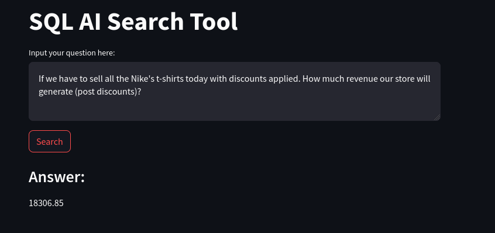
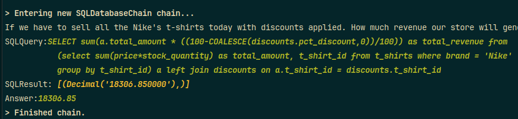

# Generative AI SQL Search Tool

### Tools
- Python
- LangChain
- Streamlit

### Concepts
- Gen AI
- LLM (GooglePalm)
- Chains
- Prompts & Templates
- Few Shots Learning
- Embeddings
- Vector DB

### Usage demonstration

Ask your question about the data stored in database and click `Search`

Background chain executed

